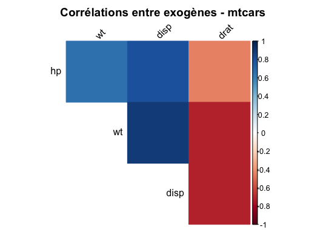

title: "3.1 — Détection de la colinéarité"

## Introduction

En régression linéaire multiple, on cherche à établir une relation entre des variables explicatives (exogènes) et une variable à expliquer (endogène). Dans l'idéal, chaque variable apporte une information unique.

Mais dans la pratique, certaines variables sont fortement corrélées. C'est la **colinéarité**.

**Problèmes causés :**
- Coefficients instables et difficiles à interpréter
- Masquage de l'effet de certaines variables
- Risque d'éliminer à tort des variables importantes

Nous utilisons la base **mtcars** (32 voitures) avec :
- `mpg` : consommation (endogène)
- `hp` : puissance, `wt` : poids, `disp` : cylindrée, `drat` : rapport de pont

---

## Définition

On parle de colinéarité lorsque deux variables explicatives ont une corrélation élevée (|r| > 0,8).

---

## Résultats sur mtcars

**Matrice des corrélations (exogènes uniquement) :**

| Variable | hp | wt | disp | drat |
|----------|-----|-----|------|------|
| hp | 1.00 | 0.66 | 0.79 | -0.45 |
| wt | 0.66 | 1.00 | 0.89 | -0.71 |
| disp | 0.79 | 0.89 | 1.00 | -0.71 |
| drat | -0.45 | -0.71 | -0.71 | 1.00 |

**Observations :**
- `wt` et `disp` : 0,89 (> 0,8) → colinéarité sévère
- `disp` et `hp` : 0,79 (proche du seuil) → colinéarité suspectée

---

## Les 4 conséquences principales

| # | Conséquence | Exemple sur mtcars |
|---|-------------|---------------------|
| 1 | Signes contradictoires | `disp` : corrélation négative avec mpg (-0,85) mais coefficient positif dans la régression |
| 2 | Variances gonflées | Les estimateurs deviennent instables (VIF élevé, vu en 3.1.3) |
| 3 | Coefficients non significatifs | `drat` a un sens mécanique mais p-value souvent élevée |
| 4 | Instabilité des résultats | Les coefficients changent selon l'échantillon |

---

## Pourquoi c'est un problème

- On ne peut plus dire **"toutes choses égales par ailleurs"**
- On risque d'**éliminer à tort** des variables importantes
- Les **tests de significativité** deviennent peu fiables

➡️ **Avant toute interprétation, il faut détecter la colinéarité (sections 3.1.2 et 3.1.3).**

---
## Code R utilisé
Le script complet est dans R/part1_colinearite.R.

## Test de Klein pour la détection de la colinéarité

### Principe du test

Le test de Klein compare le coefficient de détermination du modèle global \(R^2\) avec les carrés des corrélations entre variables explicatives \(r^2_{x_i x_j}\). La règle est la suivante :

- Si \( r^2_{x_i x_j} > R^2 \) → **colinéarité forte** détectée  
- Si \( r^2_{x_i x_j} \) est proche de \( R^2 \) → **colinéarité modérée** à surveiller  

---

### Mise en œuvre dans R

    # TEST DE KLEIN POUR DÉTECTER LA COLINÉARITÉ

    # Régression multiple
    regression <- lm(mpg ~ hp + wt + disp + drat, data = mtcars)
    R2 <- summary(regression)$r.squared

    # Matrice des corrélations entre exogènes
    mat_cor <- cor(mtcars[, c("hp", "wt", "disp", "drat")])
    mat_cor_carre <- mat_cor^2

    # Affichage des résultats
    cat("R² du modèle global =", round(R2, 4), "\n\n")
    cat("Matrice des r² entre exogènes :\n")
    print(round(mat_cor_carre, 4))

    # Comparaison R² vs r²
    cat("\nComparaison détaillée :\n")
    for(i in 1:4) {
      for(j in 1:4) {
        if(i < j) {
          r2_ij <- mat_cor_carre[i,j]
          var_i <- rownames(mat_cor)[i]
          var_j <- colnames(mat_cor)[j]
          diff <- R2 - r2_ij
          cat(var_i, "-", var_j, ": r² =", round(r2_ij, 4), 
              "| R² - r² =", round(diff, 4), "\n")
        }
      }
    }

---

### Interprétation

Aucune paire de variables n’a un \( r^2 \) supérieure au \( R^2 \) (0,8376). Selon le critère de Klein, il n’y a donc pas de colinéarité forte.

Cependant, la paire *wt* (poids) et *disp* (cylindrée) présente un \( r^2 = 0,7885 \), très proche du \( R^2 \) global (différence de seulement 0,0491). Cette forte corrélation (\( r = 0,888 \)) est préoccupante car :

- Les deux variables mesurent des concepts similaires (taille du véhicule)  
- Des erreurs-types gonflées peuvent rendre les coefficients instables  
- La significativité individuelle des variables peut être sous-estimée  

Ce diagnostic est renforcé par le conflit de signe observé pour la variable *disp*, ce qui confirme l’instabilité des coefficients due à la colinéarité.

---

### Conclusion du test de Klein

Le test de Klein révèle une colinéarité modérée à surveiller entre les variables *wt* et *disp*. Bien que le seuil strict ne soit pas atteint, la proximité entre \( r^2 \) et \( R^2 \) indique un risque réel de multicolinéarité.

---

### Limites du test de Klein

- Le test n’est pas un test statistique formel (pas de p-value, pas de seuil universel)  
- Il ne détecte que la colinéarité par paires  
- Une colinéarité multiple peut ne pas être détectée  
- Si \( r^2 > R^2 \), cela indique une très forte colinéarité  

---

### Recommandations

- Calculer les facteurs d’inflation de la variance (VIF) pour confirmer le diagnostic  
- Envisager de supprimer une variable redondante (*wt* ou *disp*)  
- Utiliser une régression ridge pour stabiliser le modèle  

#### 1.4.2. Facteur d'Inflation de la Variance (VIF) : Calcul matriciel et Tolérance

Pour quantifier précisément la multi-colinéarité, le calcul du Facteur d'Inflation de la Variance (VIF) est incontournable. L'algèbre linéaire démontre que les valeurs du VIF correspondent exactement à la diagonale principale de l'inverse de la matrice de corrélation ($C^{-1}$).

**Tableau 7 : Valeurs du VIF et Tolérance calculées via $C^{-1}$**

| Variable | VIF_Calcule | Tolerance |
| :--- | :--- | :--- |
| hp | 2.89 | 0.345 |
| wt | 5.10 | 0.196 |
| disp | 8.21 | 0.122 |
| drat | 2.28 | 0.439 |

Pour mieux appréhender la gravité de la colinéarité, nous l'avons représentée graphiquement par rapport au seuil critique usuel de 5.

**Figure 2 : Niveaux de VIF par variable explicative**

**Interprétation :**
Les règles empiriques usuelles fixent un seuil critique de VIF à 5 (Tolérance < 0.20) pour une colinéarité forte. Le graphique (Figure 2) met en évidence une colinéarité critique pour deux variables : la cylindrée (`disp`) avec un VIF de 8.21, suivie par le poids (`wt`) avec 5.10. Près de 88% de l'information de la cylindrée (Tolérance de 0.122) est redondante. L'espace explicatif de notre modèle est donc saturé.

#### 1.4.3. Test de la Cohérence des Signes

Pour vérifier l'instabilité des estimateurs, nous confrontons le signe de la corrélation marginale avec le signe du coefficient partiel issu de la régression multiple.

**Tableau 8 : Comparaison des corrélations simples et des coefficients multiples**

| Variable | Correlation_Simple | Coef_Regression | Conflit_Signe |
| :--- | :--- | :--- | :--- |
| hp | -0.776 | -0.035 | FALSE |
| wt | -0.868 | -3.480 | FALSE |
| disp | -0.848 | 0.004 | TRUE |
| drat | 0.681 | 1.768 | FALSE |

**Conflit détecté :**
Le Tableau 8 révèle une aberration majeure concernant la variable `disp` (Cylindrée) :
1. De manière isolée, la cylindrée et la consommation (`mpg`) ont une corrélation **négative** (-0.848). Ceci est physiquement logique.
2. Pourtant, dans la régression multiple, le coefficient estimé pour `disp` devient **positif** (+0.004). Le modèle suggère artificiellement qu'augmenter la cylindrée améliore la consommation !
Cette inversion de signe illustre "l'effet de masque" provoqué par l'interférence colinéaire.

#### 1.5. Conclusion de la détection

**Bilan : Une colinéarité sévère.** Le diagnostic posé sur les données `mtcars` est sans équivoque : les trois approches d'investigation convergent pour désigner la redondance critique du trio `disp`, `wt` et `hp`.
Dans ces conditions, il est impératif de procéder à un retrait stratégique de certaines variables. Cette optimisation de l'espace explicatif fait l'objet de l'étape de **Sélection de variables** (Groupe A).
