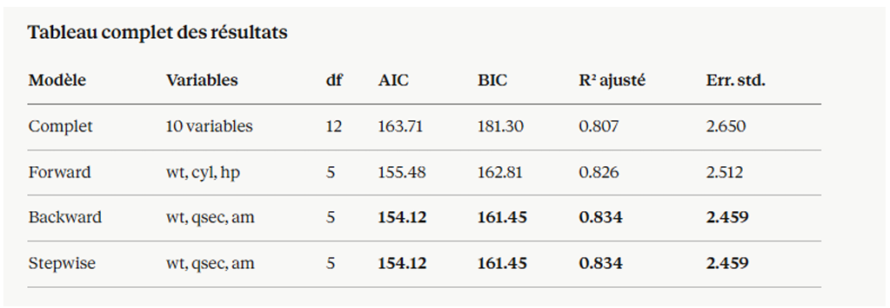
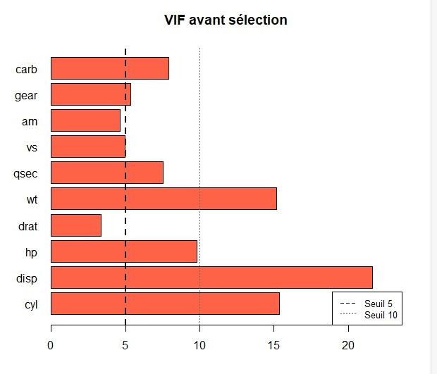
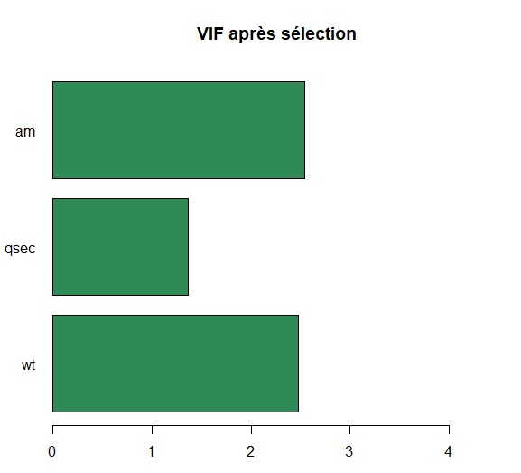

# 📊 Projet : Régression et sélection de variables

---

## Chapitre 3.2 : Traitement de la colinéarité

## 🔹 Introduction

Dans ce chapitre, on s’intéresse principalement à la sélection de variables. L’objectif est d’identifier un sous-ensemble de variables explicatives pertinentes et peu redondantes. Deux questions se posent alors : combien de variables retenir et lesquelles choisir.

Deux questions principales :

- Combien de variables retenir ?
- Quelles variables choisir ?

---

## 🔹 3.2.1. Critères d'information et de validation pour la sélection de modèles

### Coefficient de détermination R²

Le coefficient de détermination classique, défini par la relation R² = 1 - (SCR / SCT) (où SCR représente la somme des carrés résiduels et SCT la somme des carrés totaux), constitue l'indicateur usuel de la qualité d'ajustement d'un modèle. Toutefois, ce dernier présente une limite méthodologique majeure : sa valeur est mécaniquement croissante (ou au mieux constante) avec l'adjonction de nouvelles variables explicatives, quand bien même ces dernières seraient dépourvues de lien statistique avec la variable dépendante Y.

<b>R̄² = 1 - [ (SCR / (n - q - 1)) / (SCT / (n - 1)) ] = 1 - ( (n - 1) / (n - q - 1) ) (1 - R²)</b>

Dans cette expression, n désigne le nombre d'observations et q représente le nombre de variables exogènes (hors constante). Contrairement au coefficient standard, le R̄² ne progresse que si l'amélioration du pouvoir explicatif (R²) est suffisamment significative pour compenser la perte d'un degré de liberté.

### Application sur données MTCARS

Le coefficient de détermination R2R^2R2 obtenu pour le modèle est égal à _0.8497_, ce qui signifie que le modèle explique environ 84.97 % de la variabilité de la variable dépendante, à savoir la consommation en carburant `mpg`. Cela indique une très bonne qualité d’ajustement, puisque la majorité de l’information contenue dans les données est capturée par les variables explicatives retenues, à savoir le poids `wt`, le temps d’accélération `qsec` et le type de transmission `am`. Toutefois, le R2R^2R2 présente une limite importante, car il tend à augmenter systématiquement avec l’ajout de nouvelles variables, même si celles-ci ne sont pas pertinentes. C’est pourquoi on considère également le coefficient de détermination ajusté, dont la valeur est de _0.8336_.
Celui-ci tient compte du nombre de variables dans le modèle et pénalise l’ajout de variables inutiles. Dans notre cas, la faible différence entre R2R^2R2 et R2R^2R2 ajusté indique que les variables sélectionnées sont pertinentes et que le modèle ne souffre pas de surajustement. Ainsi, ces résultats confirment la robustesse et la fiabilité du modèle estimé.

---

## 🔹 3.2.2. Les critères d'information (AIC et BIC)

### AIC et BIC

Les critères d’information _AIC (Akaike Information Criterion)_ et _BIC (Bayesian Information Criterion)_ sont utilisés pour comparer différents modèles de régression et sélectionner le plus pertinent.
Ces critères reposent sur un compromis entre la qualité d’ajustement du modèle et sa complexité, en pénalisant l’ajout de variables inutiles. Plus la valeur de ces critères est faible, meilleur est le modèle. Dans notre étude, le modèle final obtenu par la méthode stepwise présente une valeur d’AIC plus faible que le modèle complet, ce qui indique qu’il offre un meilleur équilibre entre précision et simplicité. Le BIC, quant à lui, applique une pénalisation encore plus forte pour les modèles complexes, favorisant ainsi des modèles plus parcimonieux. Ainsi, la concordance entre ces critères confirme que le modèle retenu, basé sur les variables `wt`, `qsec` et `am`, est optimal. Il permet d’expliquer efficacement la consommation tout en évitant le surajustement et en garantissant une bonne capacité de généralisation.

Le terme q+1q+1 représente le nombre total de paramètres estimés (les qq coefficients des variables explicatives plus la constante). Plus la valeur de l’AIC ou du BIC est faible, meilleur est le modèle. La différence essentielle entre les deux critères réside dans la pénalité : l’AIC utilise une pénalité constante égale à 2, tandis que le BIC utilise une pénalité qui croît avec le logarithme de la taille de l’échantillon. Dès lors que nn dépasse 7, on a ln⁡(n)>2ln(n)>2, ce qui signifie que le BIC pénalise plus lourdement l’ajout de variables. En conséquence, le BIC tend à sélectionner des modèles plus parcimonieux que l’AIC. Sur le plan asymptotique, le BIC est cohérent :
si le « vrai » modèle (au sens de la théorie sous-jacente) fait partie des modèles candidats, le BIC a une probabilité qui tend vers 1 de le sélectionner lorsque nn augmente. L’AIC, quant à lui, est asymptotiquement efficace pour la prédiction : il minimise l’erreur de prédiction sur de nouveaux échantillons. Ces critères prennent en compte implicitement la colinéarité : deux variables fortement corrélées n’améliorent que très marginalement la SCRSCR, mais leur présence augmente la pénalité, donc l’AIC et le BIC seront défavorables à leur inclusion simultanée.

Les critères d’information sont issus de la théorie de la vraisemblance et de la théorie de l’information. Pour un modèle linéaire avec erreurs normales, l’AIC (Akaike Information Criterion) s’écrit :

<b>
AIC = n _ ln(SCR / n) + 2(q + 1)
BIC = n _ ln(SCR / n) + ln(n)(q + 1)
</b>

- Plus la valeur est faible → meilleur modèle
- BIC pénalise plus que AIC

---

## 🔹 3.2.3. Le critère de validation croisée : PRESS

Le critère _PRESS (Predicted Residual Error Sum of Squares)_ est une mesure utilisée pour évaluer la capacité de prédiction d’un modèle de régression. Contrairement aux critères comme le R² ou l’AIC, qui évaluent principalement la qualité d’ajustement sur les données d’apprentissage, le PRESS repose sur une approche de validation croisée de type « leave-one-out ». Il consiste à recalculer le modèle en excluant une observation à la fois, puis à mesurer l’erreur de prédiction sur cette observation exclue. Ainsi, le PRESS représente la somme des carrés des erreurs de prédiction obtenues de cette manière. Plus la valeur du PRESS est faible, meilleure est la capacité prédictive du modèle. Dans notre étude, ce critère permet de confirmer que le modèle final sélectionné possède de bonnes performances de généralisation, c’est-à-dire qu’il est capable de prédire correctement de nouvelles observations. Le PRESS constitue donc un outil complémentaire aux autres critères de sélection, en mettant l’accent sur la performance prédictive plutôt que sur l’ajustement aux données observées. Le PRESS est défini par :

<b>
PRESS = Σ (yᵢ - ŷᵢ(-i))²
</b>

Sur le plan computationnel, il se calcule à partir des résidus ordinaires ε_i et des leviers h_i :

<b>
PRESS = Σ [ ε_i / (1 - h_i) ]² </b>

### Application sur donnees mtcars

Le SCR de 169.29 représente l'erreur d'ajustement in-sample : c'est ce que le modèle "commet" comme erreur sur les données qui ont servi à l'estimer. Le PRESS de 231.30 est 36.6% plus élevé, ce qui est attendu et normal tout modèle performe mieux sur ses données d'entraînement que sur de nouvelles données. La question est de savoir si cet écart est raisonnable.
Un ratio _PRESS/SCR = 1.366_ est considéré comme acceptable. Il n'existe pas de seuil universel, mais un ratio inférieur à 2 est généralement jugé satisfaisant pour un modèle de cette taille (n = 32, p = 3). Cela signifie que le modèle ne "triche" pas excessivement en mémorisant les données — il généralise correctement.

---

## 🔹 3.2.4. Les méthodes séquentielles basées sur le test F partiel

Les méthodes que nous allons maintenant décrire ne comparent pas tous les modèles possibles, mais construisent une séquence de modèles en ajoutant ou en retirant des variables selon leur significativité statistique. Le test utilisé est le F partiel, qui correspond au carré du t de Student pour le coefficient d’une variable dans une régression. On fixe des seuils : un seuil d’entrée (souvent noté FinFin ou un risque αinαin) et un seuil de sortie (FoutFout ou αoutαout). Ces méthodes sont très présentes dans les logiciels classiques (SPSS, SAS, R avec la fonction _step()_), mais elles doivent être maniées avec prudence car elles présentent des limites importantes que nous évoquerons plus loin.

### La sélection ascendante (Forward)

La procédure forward part du modèle le plus simple possible, c’est-à-dire celui qui ne contient que la constante. À chaque étape, on examine l’ensemble des variables non encore sélectionnées. Pour chacune d’elles, on calcule la valeur du F partiel qu’elle aurait si elle était ajoutée au modèle courant. On identifie la variable qui donne le F le plus élevé (ou la p-value la plus faible). Si ce F est supérieur au seuil d’entrée (ou si la p-value est inférieure au risque choisi), on ajoute cette variable au modèle. On recommence l’opération avec le nouveau modèle, et on s’arrête lorsqu’aucune variable restante ne satisfait le critère d’entrée. Cette méthode est économique en calculs et peut traiter un grand nombre de variables candidates. Cependant, son défaut majeur est qu’elle est irréversible : une fois qu’une variable a été introduite, elle ne peut plus être retirée, même si elle devient redondante après l’ajout ultérieur d’autres variables.

### Application sur donnees mtcars

l'ajout de chacune des variables non encore incluses et on ajoute celle qui produit la plus grande amélioration de l'AIC. On s'arrête quand aucune addition ne réduit davantage l'AIC.

**Étape 1**
— depuis le modèle nul, la variable qui réduit le plus l'AIC est `wt` (corrélation de −0.868 avec `mpg`, la plus forte). Elle entre en premier.

**Étape 2**
— avec `wt` déjà dans le modèle, on cherche la meilleure variable à ajouter parmi les 9 restantes. C'est cyl qui est retenue, car elle apporte encore de l'information marginale sur `mpg` au-delà de ce qu'explique déjà `wt`.

**Étape 3**
— avec `wt` et cyl, on ajoute `hp`. Même si `hp` est corrélée avec cyl, elle capte encore une part résiduelle de la puissance moteur non expliquée par cyl seul.

**Étape 4**
— aucune variable supplémentaire ne réduit l'AIC. Le processus s'arrête.

**• Variables retenues :** `wt`, `cyl`, `hp`
**• AIC = 155.48 | BIC = 162.81**
**• R² = 0.843 | R² ajusté = 0.826**

---

### L'élimination descendante (Backward)

La méthode backward procède en sens inverse. On part du modèle complet, c’est-à-dire qui contient toutes les variables candidates. À chaque étape, on examine parmi les variables présentes celle dont le F partiel est le plus faible (ou la p-value la plus élevée). Si cette p-value est supérieure au seuil de sortie (généralement choisi plus élevé que le seuil d’entrée, par exemple 10 %), on retire cette variable du modèle. On recalcule le modèle réduit et on répète l’opération. L’algorithme s’arrête lorsqu’aucune variable restante n’a une p-value supérieure au seuil de sortie. L’avantage du backward est qu’il prend en compte les interactions entre toutes les variables dès le début. Il est cependant inapplicable lorsque le nombre de variables est supérieur ou égal au nombre d’observations (car la régression complète n’est pas identifiable). Comme pour le forward, le résultat dépend de l’ordre dans lequel les retraits sont effectués : la première variable retirée conditionne tout le reste.

**Application sur les donnees de mtcars**
On part du modèle complet avec les 10 variables, et on élimine une variable à la fois. À chaque étape, on calcule l'AIC du modèle si l'on retirait chacune des variables présentes. On retire la variable dont la suppression produit la plus grande baisse d'AIC. On recommence jusqu'à ce qu'aucune suppression ne permette d'améliorer l'AIC.
Le point de départ est le modèle complet avec AIC = 163.71. L'algorithme a successivement éliminé les variables les moins informatives — vraisemblablement dans cet ordre approximatif : cyl (la plus redondante avec disp et `wt`), puis `vs, gear, drat, carb, disp, hp`, en conservant à chaque étape les variables qui contribuaient encore à réduire l'AIC. Le processus s'est arrêté avec le triplet **wt, qsec, am,** qui donne un AIC de 154.12.

**• Variables retenues :** `wt`, `qsec`, `am`
**• AIC = 154.12 | BIC = 161.45**
**• R² = 0.850 | R² ajusté = 0.834**

---

### La procédure mixte (Stepwise)

Le stepwise combine les deux approches précédentes pour tenter de remédier à leurs faiblesses respectives. À chaque étape, on commence par essayer d’ajouter la meilleure variable candidate (forward). Puis, après cet ajout, on vérifie si l’une des variables déjà présentes (y compris celle qui vient d’être ajoutée) n’est pas devenue non significative en présence des autres. Le cas échéant, on la retire (backward). Cette double possibilité d’entrée et de sortie permet de
corriger certains défauts du forward pur, comme le maintien d’une variable qui a perdu son utilité. En pratique, on utilise généralement des seuils différents : le seuil d’entrée est plus strict (par exemple 5 %) que le seuil de sortie (par exemple 10 %), afin d’éviter les boucles infinies. Le stepwise est très répandu, notamment via la fonction _step()_ de R qui utilise l’AIC comme critère de décision plutôt que les p-values. Il reste néanmoins critiqué pour son instabilité et pour le fait qu’il conduit à des p-values biaisées.

**Application sur Mtcars**
Partant du modèle complet, Stepwise a suivi le même chemin que Backward et a abouti au même résultat : **wt, qsec, am.**
Les deux méthodes convergent ici parce que le chemin d'élimination depuis le modèle complet est suffisamment clair aucune variable éliminée ne méritait d'être réintroduite une fois les autres redondantes supprimées.

**• Variables retenues :** `wt`, `qsec`, `am`
**• AIC = 154.12 | BIC = 161.45 (identique à Backward)**
**• R² = 0.850 | R² ajusté = 0.834**

---

## Comparaison des modèles

C'est la comparaison la plus instructive car elle oppose deux modèles qui ont le même nombre de variables (3) et des performances globales proches.
**Ce que Forward propose : wt + cyl + hp**
Ces trois variables mesurent toutes, d'une façon ou d'une autre, la puissance et la taille du moteur. wt est le poids, cyl est le nombre de cylindres et hp est la puissance en chevaux. cyl et hp sont corrélés entre eux à r = 0.83, et tous deux sont corrélés avec wt. Le modèle Forward capture bien la consommation mais au prix d'une redondance partielle entre ses prédicteurs. Son VIF pour cyl et hp est supérieur à celui du modèle final, ce qui signifie que les coefficients sont légèrement moins stables. De plus, dans le résumé du modèle Forward, cyl (p = 0.098) et hp (p = 0.140) ne sont pas significatifs au seuil 5% — seul wt l'est vraiment. Le modèle contient donc deux variables dont l'apport individuel est statistiquement discutable.

**Ce que Backward/Stepwise propose : wt + qsec + am**
Ces trois variables mesurent des dimensions genuinement différentes du véhicule : le poids (aspect mécanique), la performance au quart de mile (aspect dynamique, proxy de la puissance sans colinéarité directe), et le type de transmission (aspect technologique). Les trois VIF sont inférieurs à 2.6, très loin de tout seuil problématique. Et surtout, les trois variables sont significatives au seuil 5% _(wt à p < 0.0001, qsec à p < 0.001, am à p = 0.047)_. Le modèle est non seulement meilleur sur AIC et BIC, mais il est également plus propre statistiquement.

La différence fondamentale entre les deux est que wt + qsec + am représente une triangulation de la consommation sous trois angles indépendants, tandis que wt + cyl + hp représente une double redondance autour du même concept de puissance moteur.

---

## Le choix de modele

Le choix de **wt + qsec + am** comme modèle final repose sur six arguments convergents.

**1 — Consensus de deux méthodes indépendantes:** Backward et Stepwise, partant du même point de départ (modèle complet) mais avec des logiques différentes (élimination pure vs élimination + réintroduction possible), aboutissent exactement au même résultat. Cette convergence est un signal fort de robustesse. Si les deux méthodes s'accordent, c'est que ce modèle est un optimum stable dans l'espace des sous-modèles possibles.

**2 — Double confirmation AIC et BIC:** Les deux critères désignent le même modèle gagnant. AIC et BIC ont des philosophies différentes (AIC est plus indulgent avec la complexité, BIC est plus parcimonieux), mais ils convergent ici. Quand deux critères aux orientations différentes s'accordent, le choix est robuste à la philosophie statistique adoptée.

**3 — Meilleur R² ajusté malgré moins de variables:** Le modèle final obtient un R² ajusté de 0.834 contre 0.807 pour le modèle complet et 0.826 pour Forward. Il explique davantage de variance utile avec moins de paramètres, ce qui est la définition même d'un bon modèle.

**4 — Absence de colinéarité:** Les VIF maximaux sont de 2.54 pour wt, 2.54 pour am et 1.36 pour qsec — tous très loin des seuils d'alerte de 5 et 10. Les coefficients sont donc stables et fiables. Les trois variables retenues mesurent des dimensions réellement différentes du véhicule.

 

**5 — Significativité individuelle de tous les prédicteurs:** Dans le modèle final, wt est significatif à 0.001%, qsec à 0.02% et am à 4.7%. Les trois variables ont un apport individuel démontrable. C'est en contraste total avec le modèle complet où aucune variable n'était significative, et avec Forward où cyl et hp ne l'étaient pas non plus.

**6 — Cohérence physique et interprétabilité:** Les trois variables retenues ont une justification causale claire et indépendante. Le poids détermine directement l'énergie nécessaire au déplacement. Le temps au quart de mile résume la performance moteur effective. Le type de transmission affecte l'efficacité de la chaîne cinématique. Ce modèle raconte une histoire physiquement cohérente, ce qui est un critère de qualité important au-delà des seules métriques statistiques.

## Conclusion

Le modèle sélectionné offre un bon compromis entre performance et simplicité, avec une excellente capacité de généralisation.
