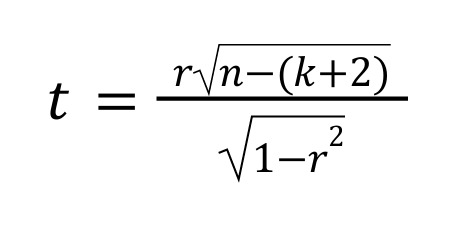
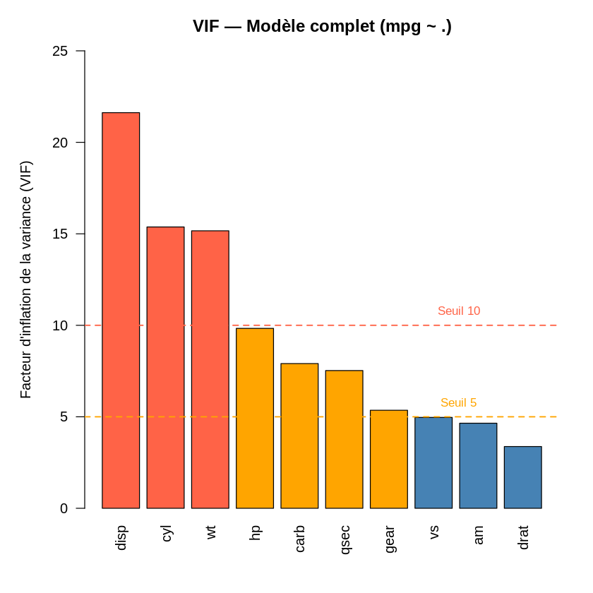
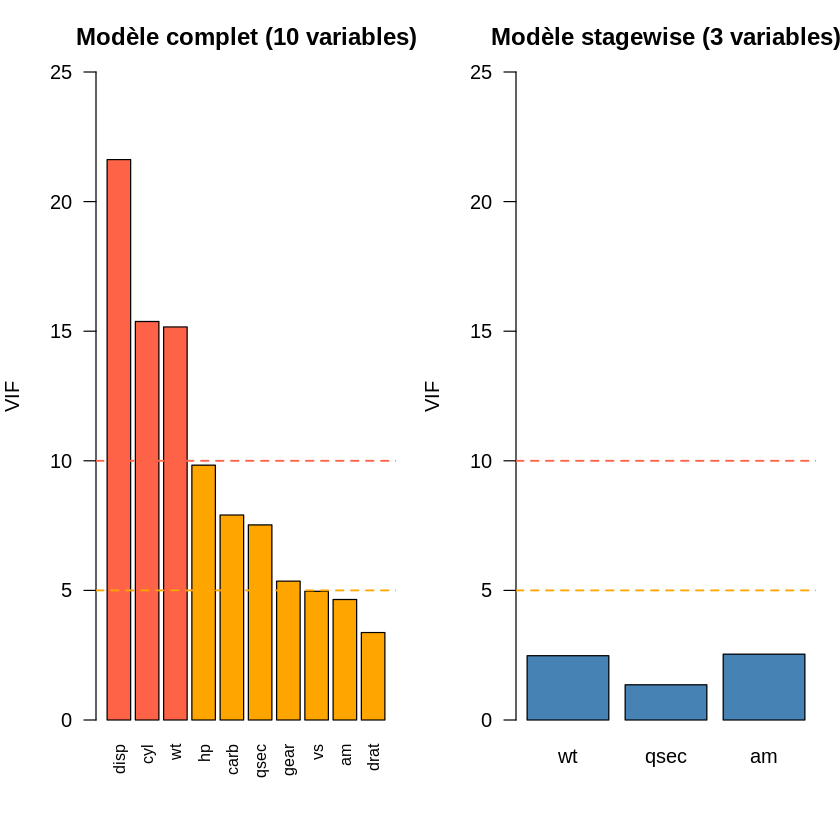
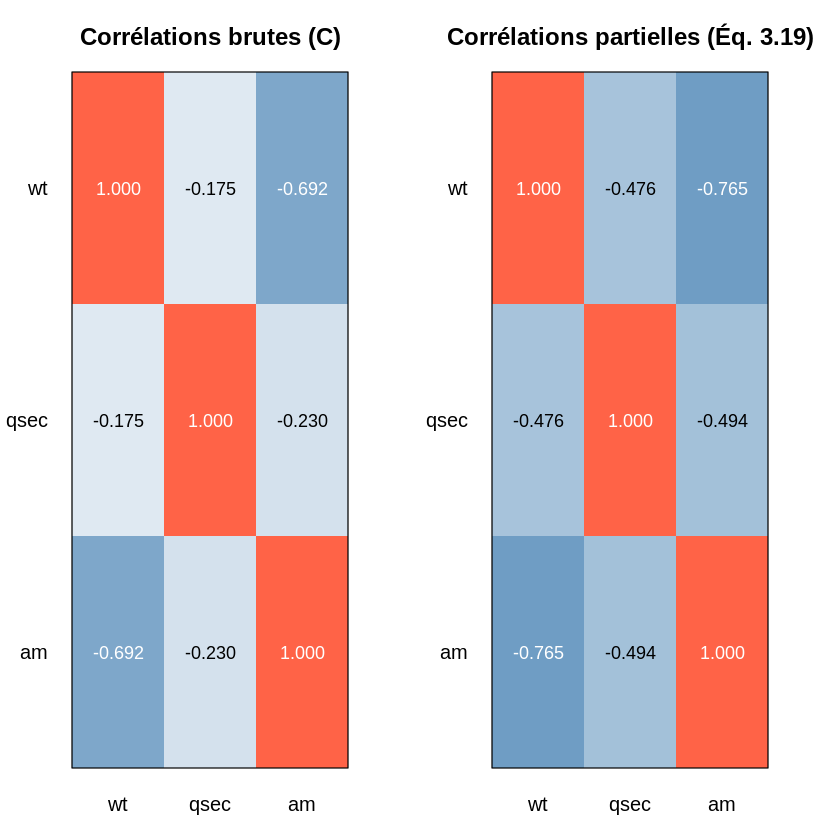

# Régression Stagewise — Sélection Progressive de Variables

## 1. Description

Ce chapitre présente l’implémentation et l’analyse de la **régression Stagewise**, une méthode de sélection progressive de variables utilisée en régression linéaire multiple.

L’objectif principal est de construire un modèle **simple, interprétable et statistiquement pertinent**, en sélectionnant progressivement les variables explicatives les plus importantes pour prédire la consommation de carburant (`mpg`) du dataset **mtcars**.

## 2. Objectifs de la méthode Stagewise

La régression Stagewise vise à :

- sélectionner automatiquement les variables les plus importantes ;
- construire un modèle plus simple et plus interprétable ;
- éviter l’ajout de variables non significatives ;
- expliquer progressivement la variable dépendante (`mpg`) ;
- réduire les effets de la multicolinéarité entre prédicteurs.

## 3. Principe de la méthode Stagewise

La méthode suit un processus itératif :

1. Sélectionner la variable ayant la plus forte corrélation avec la variable cible (`mpg`).
2. Vérifier si cette variable est statistiquement significative à l’aide du **test de Student**.
3. Construire un modèle avec cette variable.
4. Calculer les résidus du modèle.
5. Rechercher la variable la plus corrélée avec les résidus.
6. Tester sa significativité statistique.
7. Répéter le processus jusqu’à ce qu’aucune variable candidate ne soit significative.

Une variable est conservée uniquement si :

```math
p\text{-value} < \alpha
```

---

## 4. Test de Student

La significativité des corrélations est évaluée avec le test de Student suivant :



Où :
- `r` : coefficient de corrélation ;
- `n` : nombre d’observations ;
- `k` : nombre de variables déjà sélectionnées.

## 5. Résultats obtenus

Après application de la méthode Stagewise sur le dataset `mtcars`, les variables retenues sont :

| Variable | Interprétation |
|----------|----------------|
| wt | Poids du véhicule |
| qsec | Temps au quart de mile |
| am | Type de transmission |

## 6. Modèle final obtenu

```math
mpg \sim wt + qsec + am
```

---

# Régressions Partielles 

## Définition

La régression partielle permet d’étudier l’effet propre d’une variable explicative sur une variable cible tout en éliminant l’influence des autres variables du modèle.

Dans cette étude, nous analysons l’influence de plusieurs variables sur la consommation des véhicules (`mpg`) du dataset `mtcars`.

## Principe des régressions partielles

La méthode repose sur les étapes suivantes :

1. Régression de la variable cible `Y` sur les variables de contrôle.
2. Extraction des résidus.
3. Régression de la variable explicative `Xj` sur les mêmes variables de contrôle.
4. Extraction des résidus associés.
5. Régression entre les deux séries de résidus.

Cette approche permet de mesurer l’effet additionnel réel de chaque variable explicative.

## Variables étudiées

### Variable cible
- `mpg` : consommation du véhicule

### Variables de contrôle
- `wt` : poids du véhicule
- `disp` : cylindrée du moteur

### Variables explicatives
- `hp` : puissance du moteur
- `qsec` : temps au quart de mile
- `cyl` : nombre de cylindres

## Traitement des données

### Étude de la variable `hp`

L’objectif est de vérifier si `hp` apporte une information additionnelle sur `mpg` après prise en compte des variables de contrôle `wt` et `disp`.

### Construction des résidus

- Régression de `mpg` sur `wt` et `disp`
- Régression de `hp` sur `wt` et `disp`

Les résidus obtenus permettent de supprimer l’effet des variables de contrôle.


## Comparaison des résultats

Le tableau suivant synthétise les principaux résultats obtenus :

| Variable | β̂ | p-value | R² partiel |
|----------|----------|----------|----------|
| hp   | -0.03116 | 0.00843 | 0.2095 |
| qsec | 0.9266   | 0.00877 | 0.2076 |
| cyl  | **-1.7849** | **0.00483** | **0.2359** |

Les variables `hp`, `qsec` et `cyl` présentent toutes une influence statistiquement significative sur `mpg`.

Cependant, la variable `cyl` possède :
- la plus faible p-value ;
- le coefficient de détermination partiel le plus élevé.

Elle représente donc la contribution additionnelle la plus importante parmi les variables étudiées.

---

# Régressions Croisées — Analyse de la Multicolinéarité

## 1. Description

Ce chapitre présente l'analyse des **régressions croisées** appliquée aux trois variables retenues par la méthode Stagewise : `wt`, `qsec` et `am`.

En régression linéaire multiple, il ne suffit pas de sélectionner des variables significatives par rapport à la variable cible. Il faut également s'assurer que les prédicteurs retenus ne sont pas trop corrélés **entre eux**. Lorsque des variables explicatives partagent une information commune, on parle de **multicolinéarité**. Ce phénomène peut :

- gonfler artificiellement les variances des coefficients estimés,
- rendre les estimations instables et sensibles aux données,
- produire des résultats contradictoires malgré un R² élevé — signe inattendu sur un coefficient, p-value élevée alors que la variable est pertinente.

L'analyse des régressions croisées vise précisément à **détecter, quantifier et interpréter** ces dépendances entre prédicteurs.


## 2. Objectifs

L'analyse poursuit quatre objectifs complémentaires :

1. Mesurer la **redondance d'information** entre les variables explicatives sélectionnées.
2. Détecter statistiquement les **dépendances linéaires** entre prédicteurs.
3. Quantifier le **lien pur** entre deux variables après neutralisation des effets de la troisième.
4. Comparer le modèle Stagewise (3 variables) au modèle complet (10 variables) pour valider que la sélection a bien résolu les problèmes de multicolinéarité.


## 3. Principe — Trois niveaux d'analyse

L'approche retenue suit trois niveaux d'analyse complémentaires, d'après la méthodologie de **Rakotomalala**. Chaque niveau apporte un éclairage différent sur la même question : les prédicteurs sont-ils trop liés entre eux ?

### Niveau 1 — VIF local (Variance Inflation Factor)

Le VIF mesure dans quelle proportion la variance d'un coefficient estimé est **gonflée** par la présence de corrélation avec les autres prédicteurs. Pour chaque variable $X_i$, on construit un modèle auxiliaire où $X_i$ est expliquée par les autres variables. Le VIF est alors calculé à partir du R² de ce modèle :

$$VIF_i = \frac{1}{1 - R^2_{aux,i}}$$

Un VIF égal à 1 signifie une absence totale de colinéarité. Plus le VIF augmente, plus l'estimation du coefficient associé devient instable.

**Règle de décision :**

| VIF | Interprétation |
|:---:|----------------|
| < 5 | Inflation acceptable — aucun problème |
| 5 à 10 | Inflation préoccupante — à surveiller |
| > 10 | Colinéarité critique — coefficients peu fiables |


### Niveau 2 — Test F auxiliaire

Le test F auxiliaire permet de **tester statistiquement** si la dépendance entre un prédicteur et les autres est significative. Pour chaque variable $X_i$, après avoir régressé $X_i$ sur les autres prédicteurs, on calcule la statistique F suivante :

$$F = \frac{R^2_{aux} \;/\; (p-1)}{(1 - R^2_{aux}) \;/\; (n - p)}$$

Où $p$ est le nombre de prédicteurs dans le modèle et $n$ le nombre d'observations.

Une p-value faible (< 0.05) indique une dépendance statistiquement significative. Cependant, **le test F signale la présence d'une dépendance, mais ne juge pas sa gravité**. C'est le VIF qui permet de trancher : une dépendance détectée par le test F mais associée à un VIF faible reste acceptable en pratique.


### Niveau 3 — Corrélations partielles

La corrélation brute entre deux variables peut être trompeuse : elle inclut des effets indirects véhiculés par les autres prédicteurs. La **corrélation partielle** mesure le lien **direct et pur** entre deux variables $X_i$ et $X_j$, une fois neutralisé l'effet de toutes les autres variables du modèle.

Elle est calculée à partir de l'inverse de la matrice de corrélation $C$ selon l'équation (3.19) :

$$r_{ij \mid k} = \frac{-v_{ij}}{\sqrt{v_{ii} \cdot v_{jj}}}$$

où $v_{ij}$ désignent les éléments de $C^{-1}$, l'inverse de la matrice de corrélation des prédicteurs.

Comparer corrélation brute et corrélation partielle permet de détecter un **effet suppresseur** : une situation où une troisième variable masque partiellement un lien réel entre deux autres.


## 4. Dataset utilisé

Le dataset utilisé est **mtcars**, disponible nativement dans R. Il contient 32 observations et 11 variables issues du Motor Trend US Magazine (1974).

Les variables analysées dans cette section sont les trois prédicteurs retenus par la régression Stagewise :

| Variable | Description | Type |
|:--------:|-------------|:----:|
| `wt` | Poids du véhicule (en milliers de livres) | Numérique |
| `qsec` | Temps au quart de mile (en secondes) | Numérique |
| `am` | Type de transmission (0 = automatique, 1 = manuelle) | Binaire |

**Paramètres :** n = 32 observations, p = 3 prédicteurs.


## 5. Résultats

### 5a. Baseline — VIF du modèle complet

Avant d'analyser le modèle Stagewise, les VIF du **modèle complet** à 10 variables sont calculés. Cet exercice constitue une **référence d'échec** : il illustre concrètement ce que la multicolinéarité produit lorsqu'aucune sélection de variables n'est réalisée.

**Résultats :**

| Variable | VIF | Niveau |
|:--------:|:---:|:------:|
| `disp` | 21.62 | Critique |
| `cyl` | 15.37 | Critique |
| `wt` | 15.16 | Critique |
| `hp` | 9.83 | Préoccupant |
| `carb` | 7.91 | Préoccupant |
| `qsec` | 7.53 | Préoccupant |
| `gear` | 5.36 | Préoccupant |
| `vs` | 4.97 | Acceptable |
| `am` | 4.65 | Acceptable |
| `drat` | 3.37 | Acceptable |

**VIF maximum du modèle complet : 21.62**



*Figure 1 : Facteurs d'inflation de la variance pour le modèle complet à 10 variables. Les barres rouge dépassent le seuil critique de 10 ; les barres orange sont comprises entre 5 et 10.*

**Interprétation :**

Les variables `disp` (21.6) et `cyl` (15.4) présentent une colinéarité critique. La variable `wt` (15.2), bien que pertinente pour expliquer `mpg`, est ici fortement confondue avec `disp` et `cyl`. Dans ce contexte, aucun coefficient individuel n'est statistiquement significatif malgré un R² global de 0.869 — c'est le symptôme classique d'une multicolinéarité sévère : le modèle semble ajusté, mais ses coefficients sont instables et ininterprétables.

Ce résultat justifie a posteriori la nécessité de la sélection Stagewise.

### 5b. Niveaux 1 et 2 — VIF local et Test F auxiliaire

Pour chaque variable parmi `wt`, `qsec` et `am`, on régresse cette variable sur les deux autres, puis on calcule le R² auxiliaire, le VIF et la statistique F associée.

**Résultats :**

| Variable cible | Variables explicatives | R² auxiliaire | VIF | Test F(2, 29) | p-value |
|:--------------:|------------------------|:-------------:|:---:|:-------------:|:-------:|
| `wt` | `qsec + am` | 0.5973 | 2.48 | 21.503 | 1.875e-06 |
| `qsec` | `wt + am` | 0.2670 | 1.36 | 5.283 | 1.106e-02 |
| `am` | `wt + qsec` | 0.6065 | 2.54 | 22.351 | 1.338e-06 |



*Figure 2 : Le panneau gauche illustre la multicolinéarité sévère du modèle complet (VIF max = 21.6). Le panneau droit montre que les trois prédicteurs du modèle Stagewise ont tous des VIF inférieurs à 3, bien en dessous du seuil d'alerte de 5.*

**Interprétation :**

**Variable `wt` (VIF = 2.48) :** Le test F est très significatif (p < 0.001), ce qui indique que `wt` est statistiquement liée aux deux autres prédicteurs. Néanmoins, un VIF de 2.48 représente une inflation de variance faible — bien en dessous du seuil d'alerte de 5. La dépendance est réelle mais sans conséquence sur la fiabilité des estimations.

**Variable `qsec` (VIF = 1.36) :** C'est la variable la plus indépendante du modèle. Son R² auxiliaire de 0.267 indique que `wt` et `am` n'expliquent qu'un quart de sa variance. Un VIF proche de 1 confirme l'absence de tout problème de colinéarité.

**Variable `am` (VIF = 2.54) :** Le test F est également très significatif (p < 0.001), avec un R² auxiliaire de 0.606 — `wt` et `qsec` expliquent plus de la moitié de la variance de `am`. Malgré cela, le VIF reste modéré et acceptable.

> Le test F détecte l'existence d'une dépendance ; le VIF en évalue la gravité. Tous les VIF sont inférieurs à 3 — bien en dessous du seuil critique de 5 — ce qui confirme l'absence de multicolinéarité problématique dans le modèle Stagewise.

### 5c. Niveau 3 — Corrélations partielles

La matrice de corrélation brute et la matrice de corrélation partielle sont calculées et comparées ci-dessous.

**Corrélation brute (matrice C) :**

| | `wt` | `qsec` | `am` |
|:---:|:----:|:------:|:----:|
| `wt` | 1.000 | −0.175 | −0.692 |
| `qsec` | −0.175 | 1.000 | −0.230 |
| `am` | −0.692 | −0.230 | 1.000 |

**Corrélation partielle — lien pur après neutralisation :**

| | `wt` | `qsec` | `am` |
|:---:|:----:|:------:|:----:|
| `wt` | 1.000 | −0.476 | −0.765 |
| `qsec` | −0.476 | 1.000 | −0.494 |
| `am` | −0.765 | −0.494 | 1.000 |



*Figure 3 : La heatmap de gauche représente les corrélations brutes entre les trois prédicteurs. Celle de droite représente les corrélations partielles après neutralisation de la troisième variable. L'intensité des couleurs augmente systématiquement de gauche à droite, traduisant un effet suppresseur généralisé.*

**Interprétation — Effet suppresseur :**

Une observation structurante ressort immédiatement : les corrélations partielles sont **systématiquement plus fortes** que les corrélations brutes pour toutes les paires. Ce phénomène est appelé **effet suppresseur** — chaque variable masque partiellement le lien réel entre les deux autres.

| Paire | Corrélation brute | Corrélation partielle | Ecart | Lecture |
|:-----:|:-----------------:|:---------------------:|:-----:|---------|
| `wt` et `am` | −0.692 | −0.765 | −0.073 | `qsec` atténuait le lien entre poids et transmission |
| `wt` et `qsec` | −0.175 | −0.476 | −0.301 | `am` masquait fortement le lien entre poids et vitesse |
| `qsec` et `am` | −0.230 | −0.494 | −0.264 | `wt` dissimulait le lien entre vitesse et transmission |

L'écart le plus marqué concerne la paire `wt`–`qsec` : la corrélation brute (−0.175) suggère un lien quasi nul entre le poids et le temps au quart de mile, alors que la corrélation partielle (−0.476) révèle un lien négatif modéré une fois l'effet de la transmission neutralisé. C'est `am` qui jouait ici un rôle de suppresseur.

Ces corrélations partielles élevées (jusqu'à −0.765) pourraient laisser craindre une colinéarité forte. Elles restent pourtant parfaitement cohérentes avec les VIF obtenus — tous inférieurs à 3 — confirmant que l'effet suppresseur n'affecte pas la stabilité des coefficients.

## 6. Synthèse

| Niveau | Outil | Résultat obtenu | Conclusion |
|:------:|-------|:---------------:|:----------:|
| 1 — Numérique | VIF local | VIF max = 2.54 | Inflation faible et acceptable |
| 2 — Statistique | Test F auxiliaire | Significatif pour `wt` et `am` | Dépendance détectable, sévérité faible |
| 3 — Géométrique | Corrélations partielles | Partielles > brutes (effet suppresseur) | Cohérent avec les VIF |

Les trois niveaux d'analyse convergent vers la même conclusion : bien que des dépendances linéaires existent entre les prédicteurs — et soient statistiquement détectables — leur amplitude reste faible au regard des seuils critiques. Les VIF inférieurs à 3 garantissent que les coefficients de `mpg ~ wt + qsec + am` sont **stables, fiables et interprétables**.

Le modèle Stagewise est validé du point de vue de la multicolinéarité.
